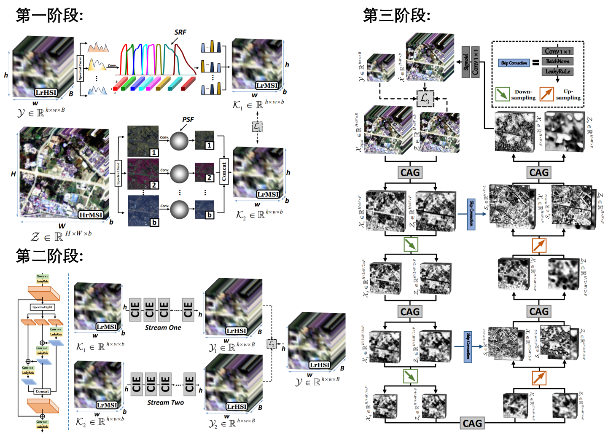
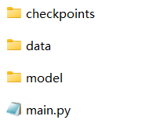

# M2U-Net_TGRS
Model-informed Multi-stage Unsupervised Network for Hyperspectral Image Super-resolution, TGRS. (PyTorch)

# $\color{red}{我的微信(WeChat): BatAug，欢迎交流与合作}$

[Jiaxin Li](https://www.researchgate.net/profile/Li-Jiaxin-20), [Ke Zheng](https://www.researchgate.net/profile/Ke-Zheng-9), [Lianru Gao](https://scholar.google.com/citations?hl=en&user=f6OnhtcAAAAJ), [Li Ni](https://orcid.org/0000-0002-9236-026X), [Min Huang](https://people.ucas.ac.cn/~huangmin), and [Jocelyn Chanussot](https://scholar.google.com/citations?user=6owK2OQAAAAJ&hl=zh-CN&oi=ao)

Our paper is accepted by IEEE Transactions on Geoscience and Remote Sensing (TGRS). 

The final version can be downloaded in my [researchgate](https://www.researchgate.net/publication/379925172_Model-informed_Multistage_Unsupervised_Network_for_Hyperspectral_Image_Super-resolution) or 🖼️[**PDF**](./Imgs/M2U-Net.pdf)

More information can be found in my [Google Scholar Citations](https://scholar.google.com/citations?user=aSPDpmgAAAAJ&hl=zh-CN).

**Fig.1.** Overall Pipeline of proposed method, abbreviated as M2U-Net, for the task of unsupervised hyperspectral image super-resolution.

## Directory structure

**Fig.2.** Directory structure. There are three folders and one main.py file in M2U-Net_TGRS-main.

### checkpoints
This folder is used to store the results and a folder named `TGSF12_band260_S1_0.001_3000_3000_S2_0.004_2000_2000_S3_0.004_7000_7000` is given as an example.

- `BlindNet.pth` is the trained parameters of Stage One.

- `estimated_lr_msi.mat` is the estimated LrMSI in Stage One, i.e., K1 and K2.

- `estimated_psf_srf.mat` is the estimated PSF and SRF.

- `gt_lr_msi.mat` is the gt lr_msi.

- `hr_msi.mat` and `lr_hsi.mat`  are simulated results as the input of our method.

- `opt.txt` is the configuration of our method.

- `Out.mat` is the output of our method.

- `Out_fmsi_S2.mat`, `Out_fhsi_S2.mat`,  `and Out_fusion_S2` are the output of Stage Two, i.e., X_s1, X_s2, and X_input.

- `psf_gt.mat` and  `srf_gt.mat` are the GT PSF and SRF.

- `Stage1.txt` is the training accuracy of Stage One.

- `Stage2.txt` is the training accuracy of Stage Two.
  
- `Stage3.txt` is the training accuracy of Stage Three.
  
### data
This folder is used to store the ground true HSI and corresponding spectral response of multispectral imager, aiming to generate the simulated inputs. The TianGong-1 HSI data and spectral response of WorldView 2 multispectral imager are given as an example here.

### model
This folder consists of ten .py files, including 
- `__init__.py`

- `config.py`: all the hyper-parameters can be adjusted here.

- `evaluation.py`: to evaluate the metrics.

- `dip.py`: the network in the Stage Three.

- `network_s2.py`: the network used in the Stage Two. 

- `network_s3.py`: the network used in the Stage Three. 

- `read_data.py`: read and simulate data.

- `select.py`: generate X_input from X_s1 and X_s2.

- `spectral_up.py`: the network in the Stage Two.

- `srf_psf_layer.py`: the network in the Stage One.

### main
- `main.py`: main.py

## How to run our code
- Requirements: codes of networks were tested using PyTorch 1.9.0 version (CUDA 11.4) in Python 3.8.10 on Windows system.

- Parameters: all the parameters need fine-tunning can be found in `config.py`.

- Data: put your HSI data and MSI spectral reponse in `./data/M2U-Net/TG` and `./data/M2U-Net/spectral_response`, respectively. The TianGong-1 HSI data and spectral response of WorldView 2 multispectral imager are given as an example here.

- Run: just simply run `main.py` after adjusting the parameters in `config.py`.

- Results: one folder named `TGSF12_band260_S1_0.001_3000_3000_S2_0.004_2000_2000_S3_0.004_7000_7000` will be generated once `main.py` is run and all the results will be stored in the new folder. A folder named `TGSF12_band260_S1_0.001_3000_3000_S2_0.004_2000_2000_S3_0.004_7000_7000` is given as an example here.

## Contact

If you encounter any bugs while using this code, please do not hesitate to contact us.
